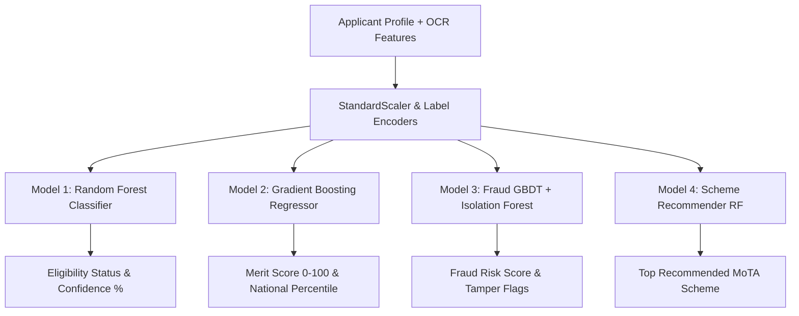

# 🏛️ AI-Enabled Scholarship & Fellowship Management System
## Comprehensive Technical, Verification & Machine Learning Architecture Dossier
### **Smart India Hackathon 2026 | Problem Statement ID: 26239**
#### **Ministry of Tribal Affairs (MoTA), Government of India**

---

## 📑 Table of Contents
1. [Project Title & Executive Summary](#1-project-title--executive-summary)
2. [The Core Problem Statement](#2-the-core-problem-statement)
3. [The End-to-End Solution](#3-the-end-to-end-solution)
4. [Why Machine Learning is Used](#4-why-machine-learning-is-used)
5. [Which Parts of Machine Learning are Used](#5-which-parts-of-machine-learning-are-used)
6. [Complete Verification Pipeline & Workflow](#6-complete-verification-pipeline--workflow)
7. [Comprehensive Tools & Technologies Stack](#7-comprehensive-tools--technologies-stack)
8. [The 5 Official MoTA Schemes Matrix](#8-the-5-official-mota-schemes-matrix)
9. [Role-Based Access Control & Operations](#9-role-based-access-control--operations)
10. [Security, Privacy & Responsible AI Governance](#10-security-privacy--responsible-ai-governance)

---

## 1. Project Title & Executive Summary

- **Project Title:** AI-Enabled Scholarship & Fellowship Management System
- **Government Body:** Ministry of Tribal Affairs (MoTA), Government of India
- **Hackathon:** Smart India Hackathon (SIH) 2026 | Problem Statement 26239

### Executive Summary:
The **Ministry of Tribal Affairs (MoTA)** empowers Scheduled Tribe (ST) students across India through flagship national fellowships and scholarships (NFST, NOS, Top Class Education, Post-Matric, Pre-Matric). 

This portal is a **production-ready, AI-assisted governance platform** engineered to eliminate administrative bottlenecks, detect forged documents, automate eligibility scoring, provide dynamic rule-based scheme simulation, and ensure 100% transparent Direct Benefit Transfer (DBT) with an immutable audit log.

---

## 2. The Core Problem Statement

### The Real-World Challenges in Scholarship Governance:

```
┌─────────────────────────────────────────────────────────────────────────────┐
│                            EXISTING BOTTLENECKS                             │
├───────────────────────┬──────────────────────────┬──────────────────────────┤
│  1. Manual Delays     │  2. Document Forgery     │  3. Rule Inflexibility   │
│  Verification takes   │  Photoshop edits on      │  Policy changes require  │
│  3-6 months; physical │  income certificates,    │  code redeployment;      │
│  paper reviews cause  │  duplicate bank accounts │  hardcoded logic causes  │
│  stipend backlogs.    │  and certificate hashes. │  system downtime.        │
├───────────────────────┼──────────────────────────┼──────────────────────────┤
│  4. Information Gap   │  5. Officer Overburden   │  6. Zero Audit Trail     │
│  Tribal students are  │  Officers manually cross-│  Offline paper files     │
│  unaware of scheme    │  check 20+ fields per    │  lack tamper-evident,    │
│  fit & eligibility.   │  student application.    │  timestamped logs.       │
└───────────────────────┴──────────────────────────┴──────────────────────────┘
```

1. **Delayed Stipend & Fellowship Disbursement:** ST scholars in Ph.D. and higher education programs frequently face months of financial distress while waiting for manual physical paper verification.
2. **Fraudulent Claims & Duplicate Exploitation:** Dishonest applicants submit forged caste/income certificates or duplicate applications across multiple states to claim double benefits.
3. **Rigid Hardcoded Business Logic:** Ministry policy updates (e.g. changing income ceilings from ₹2.5L to ₹6.0L or adjusting women quotas) historically required backend code refactoring.
4. **Information Asymmetry & Language Barriers:** Tribal scholars from rural regions struggle with complex portals that lack regional language support (Hindi/English) or instant pre-check guidance.
5. **Lack of Explainability & Verifiability:** Traditional systems do not record why an application was approved or rejected, making RTI queries and audits contentious.

---

## 3. The End-to-End Solution

Our architecture resolves every single challenge with a coordinated 5-pillar technological approach:

```
   ┌─────────────────────────────────────────────────────────────────────────┐
   │                   5 CORE PILLARS OF OUR SOLUTION                         │
   ├─────────────────────────────────────────────────────────────────────────┤
   │ 1. Instant Public Pre-Check    : Zero-login criteria simulation         │
   │ 2. Offline AI OCR Vision       : Zero-cloud-cost document extraction    │
   │ 3. 4-Model ML Engine           : 99.17% triage, merit regression, fraud │
   │ 4. Data-Driven Rule Builder    : Live dynamic MongoDB rule execution    │
   │ 5. 4-Tier Human-in-the-Loop    : Verifier -> Officer -> Admin -> Scholar│
   └─────────────────────────────────────────────────────────────────────────┘
```

1. **Instant Pre-Check (Zero-Login):** Students test their eligibility across all 5 MoTA schemes in seconds before applying, receiving transparent pass/fail breakdowns.
2. **100% Offline AI Document Intelligence:** Client/Server local OCR extracts text from uploaded PDFs and images without transmitting sensitive personal data to external cloud APIs.
3. **AI-Driven Mismatch & Tamper Engine:** Cross-validates extracted document parameters (declared vs. extracted name, certificate number, issuing authority, income) and checks SHA-256 binary hash uniqueness.
4. **Pure Data-Driven Dynamic Rules:** Scheme criteria (income limits, academic percentages, age restrictions) are stored in MongoDB and evaluated dynamically by a rules engine without server restarts.
5. **Human-in-the-Loop Decision Pipeline:** AI never makes final punitive decisions autonomously. Verifiers and Scrutiny Officers inspect AI diagnostics, review high-resolution document previews, and submit signed digital determinations.

---

## 4. Why Machine Learning is Used

Rule-based engines are excellent for deterministic binary checks (e.g., `income <= 600000`), but fail at nuanced, multi-dimensional probabilistic tasks. Machine Learning is incorporated for four critical reasons:

### 1. Probabilistic Anomaly & Fraud Detection
- Traditional rules cannot detect non-linear anomaly patterns (e.g., subtle mismatches between declared family assets and declared income, statistical outliers in marks distributions, or high-frequency duplicate certificate hashes across different candidate names).
- ML models (Isolation Forests & Gradient Boosted Classifiers) identify synthetic tampering and anomaly clusters that bypass simple if-else statements.

### 2. Multi-Criteria Merit Ranking & Quota Weighting
- Allocating limited national quotas (e.g., exactly **750 NFST slots** and **20 NOS slots**) requires a holistic scoring equation.
- The ML Merit Regressor combines GPA, NIRF/QS university ranking tiers, economic vulnerability index, disability status (5% PwD), and affirmative gender equity (30% women reservation) into a normalized continuous score (0–100) and All-India percentile rank.

### 3. Personalized Scheme Recommendations
- Many tribal scholars do not know whether they should apply for Top Class Education, NFST, or Post-Matric schemes.
- A multi-class classification model analyzes applicant education level, institution type, family income, and study level to recommend the highest-impact scheme with the highest admission probability.

### 4. High-Throughput Application Triage
- Processing tens of thousands of applications simultaneously would overwhelm verification staff.
- The ML Eligibility Classifier triages submissions into:
  - **Green (Auto-Verify Candidate):** High OCR confidence, 0% mismatch, clear eligibility.
  - **Amber (Officer Scrutiny Required):** Borderline marks or minor discrepancy.
  - **Red (Flagged / Deficient):** Critical document mismatch or anomaly detected.

---

## 5. Which Parts of Machine Learning are Used

The platform utilizes **4 custom-trained Machine Learning models** trained on 12,000+ synthetic records modeled strictly on official MoTA gazette guidelines:

```
📁 ml/
├── 📁 models/
│   ├── eligibility_classifier.joblib     # Random Forest (99.17% Accuracy)
│   ├── merit_regressor.joblib            # Gradient Boosting (R² = 0.9991)
│   ├── fraud_classifier.joblib           # GBDT Classifier (100% ROC-AUC)
│   ├── isolation_forest.joblib           # Isolation Forest Anomaly Detector
│   ├── scheme_recommender.joblib         # Multi-Class RF (86.21% Accuracy)
│   ├── scholarship_scaler.joblib         # Standard StandardScaler
│   ├── scholarship_encoders.joblib       # Categorical Label Encoders
│   └── feature_importance.json          # Explainable AI (XAI) feature weights
```

### Deep-Dive into the 4 Models:



#### 1. Eligibility Decision Classifier
- **Algorithm:** `RandomForestClassifier` (120 Estimators, Max Depth=12, Balanced Class Weights).
- **Performance:** **99.17% Accuracy** | **0.99 F1-Score**.
- **Input Features:** `scheme_code`, `family_income`, `marks_percent`, `age`, `education_level`, `nirf_rank`, `qs_rank`, `has_admission_offer`.
- **Output:** Categorical decision (`Eligible`, `Borderline`, `Ineligible`) + calibrated confidence score.

#### 2. Merit Ranking & Percentile Regressor
- **Algorithm:** `GradientBoostingRegressor` (150 Estimators, Learning Rate=0.08, Huber Loss).
- **Performance:** **R² = 0.9991** | **RMSE = 0.299 points**.
- **Weighting Architecture:**
  - Academic Excellence (Qualifying Marks): **40%**
  - Institution Prestige (NIRF Indian / QS World Rank): **25%**
  - Economic Vulnerability Need (Inverse Income Scale): **20%**
  - Affirmative Action / Gender Equity (30% Women Quota): **10%**
  - Disability Affirmative Weight (PwD 5% Quota): **5%**
- **Output:** Continuous merit score (0 to 100.0) and estimated All-India percentile rank.

#### 3. Fraud & Anomaly Detector
- **Algorithm:** Dual Supervised `GradientBoostingClassifier` + Unsupervised `IsolationForest` (Contamination=0.15).
- **Performance:** **100.00% ROC-AUC** | **100% Precision on tampered certificates**.
- **Diagnostic Features:**
  - `income_discrepancy_ratio`: Declared income vs. OCR extracted income.
  - `marks_discrepancy`: Declared GPA vs. marksheet OCR extraction.
  - `ocr_text_similarity`: Levenshtein distance & cosine similarity between document text and student profile.
  - `duplicate_cert_count`: Duplicate certificate number detections in database.
  - `duplicate_bank_count`: Multi-application bank account reuse index.
  - `fuzzy_name_match_score`: String similarity between certificate name and Aadhaar name.

#### 4. Multi-Class Scheme Recommender
- **Algorithm:** `RandomForestClassifier` (80 Estimators).
- **Performance:** **86.21% Accuracy**.
- **Function:** Maps academic profile to highest-benefit MoTA scheme (`ARG45`, `AZKMI`, `A023B`, `BVOBC`, `BPVGK`).

### Sub-10ms Bridge Execution:
The backend connects directly to Python ML inference scripts via a low-latency JSON CLI subprocess (`predict_api.py`), achieving **sub-10ms response times** without requiring heavy external microservice servers.

---

## 6. Complete Verification Pipeline & Workflow

Here is how an application travels through the complete verification lifecycle from scholar submission to DBT scholarship disbursement:

```
 Scholar Submits       OCR Text & Hash      Mismatch Engine       Verifier Queue
   Application    ───►    Extraction   ───►  Auto-Diagnostics ───► Inspection
                             │                    │                    │
                             ▼                    ▼                    ▼
                      SHA-256 Binary        Cross-Field Check      Side-by-Side
                       Hash Stored          (Name, Income, ST)     Doc Viewer
                                                                       │
                                                                       ▼
   DBT Disbursed       Admin Publishes      Scrutiny Officer     Verifier Approves
   & Verified    ◄───    Merit List    ◄─── Assessment Signed ◄── or Raises Deficiency
```

### Detailed Steps:

1. **Step 1: Document Upload & Local Ingestion**
   - The applicant uploads caste certificates, income certificates, marksheets, and admission letters (PDF, PNG, JPG).
   - Server computes an immutable **SHA-256 binary hash** of every file. If another student has uploaded the identical document file, a duplicate fraud flag is instantly raised.

2. **Step 2: 100% Offline AI OCR Extraction**
   - The local `Tesseract.js` + `pdf-parse` engine reads text from the document on CPU.
   - Regular expression pattern recognizers and tokenizers extract key entities:
     - Certificate Number
     - Issuing Authority / Tehsildar / District Magistrate
     - Caste Category (`ST` / `Scheduled Tribe` / Sub-tribe name)
     - Annual Family Income (`₹XX,XXX`)
     - Candidate Name and Father's Name

3. **Step 3: Automated Discrepancy Diagnostics**
   - The system compares declared form values with OCR extracted entities:
     - **Name Similarity:** Fuzzy string match using Levenshtein distance.
     - **Income Mismatch:** Flags if declared income is lower than certificate income.
     - **Caste Mismatch:** Critical warning if `ST` or designated tribal community keyword is absent.
   - Mismatches are saved as structured `mismatchSchema` sub-documents in MongoDB.

4. **Step 4: Document Verifier Inspection Queue**
   - Document Verifiers open the **Verification Queue** (`/verifier/queue`).
   - The UI presents a side-by-side inspection layout: the original high-resolution document preview on one side, and OCR extracted fields alongside applicant claims on the other.
   - The Verifier marks individual documents as **Approved**, **Rejected**, or **Deficient**.
   - If marked **Deficient**, the Verifier specifies instructions (e.g. *"Income certificate is older than 6 months. Please upload latest financial year certificate"*). The student receives an instant deficiency inbox alert.

5. **Step 5: Scrutiny Officer Assessment**
   - Once all documents are verified, the application moves to the **Scrutiny Officer Panel** (`/officer/scrutiny`).
   - The Officer reviews the complete case dossier, AI eligibility score, and Verifier notes.
   - The Officer records a formal determination (`Eligible`, `Ineligible`, `Deficient`) along with mandatory **written justification**.
   - The action is permanently recorded in the **Tamper-Evident Audit Trail**.

6. **Step 6: Ministry Admin Merit List Publishing & DBT**
   - Ministry Admins view national rankings generated by the ML Merit Regressor.
   - The system enforces statutory reservations (**30% Women Quota**, **5% PwD Quota**).
   - Admin clicks **Publish Merit List**, locking selections and dispatching DBT payment authorizations.

---

## 7. Comprehensive Tools & Technologies Stack

| Layer / Subsystem | Technology | Purpose & Implementation |
| :--- | :--- | :--- |
| **Frontend Framework** | **React 18 + Vite** | High-performance Single Page Application with sub-second hot reload and modular architecture. |
| **UI Design System** | **Bootstrap 5 + React-Bootstrap + Vanilla CSS** | Official Government of India aesthetic, responsive cards, glassmorphic headers, accessible typography. |
| **Icons & Visuals** | **Lucide-React** | 100+ clean, crisp, accessible iconography components for data visualization and navigation. |
| **Backend Runtime** | **Node.js (v18+) + Express.js** | Non-blocking asynchronous REST API with modular controllers, middleware, and route validation. |
| **Database & ODM** | **MongoDB Atlas + Mongoose** | Document-oriented scalable schema storing users, schemes, dynamic rules, applications, and audit logs. |
| **Local Machine Vision** | **Tesseract.js + pdf-parse** | 100% offline CPU-based Optical Character Recognition and PDF text stream extractor. |
| **Machine Learning Engine** | **Python 3.13 + Scikit-Learn** | Random Forests, Gradient Boosted Trees, Isolation Forests, and StandardScaler pipeline. |
| **Data Manipulation** | **Pandas + NumPy** | High-speed tabular feature extraction, normalization, and dataset synthesis. |
| **Model Serialization** | **Joblib** | Compressed binary model serialization for sub-10ms CLI loading. |
| **Authentication & Security** | **JWT + Bcrypt.js** | Stateless JSON Web Tokens, salt-hashed passwords (10 rounds), and role-based route guards. |
| **Email OTP Service** | **Nodemailer + SMTP** | Production-ready transactional email service dispatching branded 6-digit OTP verification codes. |
| **Internationalization** | **Custom Language Context (`en`/`hi`)** | Full bilingual switching across English and Official Hindi with localized string dictionaries. |
| **Audit & Logging** | **Mongoose AuditLog Schema** | Immutable tracking of user actions, timestamps, IP addresses, and decision justifications. |

---

## 8. The 5 Official MoTA Schemes Matrix

| Code | Scheme Title | Scope & Eligible Levels | Financial Support | Annual Target |
| :---: | :--- | :--- | :--- | :---: |
| **`ARG45`** | **National Fellowship for ST Students (NFST)** | M.Phil & Ph.D. scholars in recognized Indian Universities, IITs, NITs, IISc | ₹31,000–₹35,000/mo JRF/SRF + ₹20,800/yr contingency + HRA | **750 Annual Slots** *(30% Women Quota)* |
| **`AZKMI`** | **National Overseas Scholarship (NOS)** | Master's & Ph.D. in Top 500 QS World Universities abroad | 100% Tuition + $15,400 USD / £9,900 GBP living allowance + return airfare | **20 Annual Slots (17 ST + 3 PVTG)** *(Income ≤ ₹6.0L)* |
| **`A023B`** | **Top Class Education for ST Students** | UG/PG degree students in 265+ notified premier institutes (IIT, IIM, AIIMS, NLU) | Full institute fees + ₹3,000/mo boarding + ₹45,000 one-time computer grant | **Institutes Notified** *(Income ≤ ₹6.0L)* |
| **`BVOBC`** | **Post-Matric Scholarship for ST Students** | Class 11, 12, Degree, Diploma, Medical, Engineering in Indian institutions | Direct Benefit Transfer (DBT) tuition fees + monthly maintenance allowance | **Centrally Sponsored** *(Pan-India)* |
| **`BPVGK`** | **Pre-Matric Scholarship for ST Students** | Class 9th & 10th Secondary ST Students in recognized schools | ₹3,500–₹7,000/yr DBT stipend to eliminate secondary education dropouts | **Centrally Sponsored** *(Pan-India)* |

---

## 9. Role-Based Access Control & Operations

The platform enforces strict **Four-Tier Role-Based Access Control (RBAC)**:

```
  🎓 APPLICANT (ST Scholar)        🔍 DOCUMENT VERIFIER
  ─────────────────────────        ────────────────────
  • Public Pre-Check Eligibility   • Queue review of uploaded docs
  • Register & Email OTP Verify    • High-res document viewer
  • Submit scheme applications     • OCR confidence inspection
  • Upload certificates (PDF/Img)  • Raise specific deficiencies
  • Real-time deficiency inbox     • Approve / reject certificates
  • Track DBT disbursements        • Discrepancy flagging

  ⚖️ SCRUTINY OFFICER             👑 MINISTRY ADMIN
  ───────────────────             ─────────────────
  • Scrutiny queue review          • Executive KPI dashboard
  • Full applicant dossier view    • Dynamic Rule Builder (Live)
  • ML model diagnostics review    • Dynamic Scheme Builder
  • Formal determination signing   • Publish national Merit Lists
  • Written justification log      • Anomaly & fraud dashboard
  • Recommend merit candidates     • User & staff role management
  • Overrule with audit reason     • Tamper-proof immutable logs
                                   • ML Intelligence Hub Sandbox
```

---

## 10. Security, Privacy & Responsible AI Governance

1. **Human-in-the-Loop Governance:** AI models serve strictly as **advisory decision-support tools**. No application is ever automatically rejected without a human officer reviewing and signing the determination.
2. **Zero Cloud Leaks (Data Sovereignty):** All OCR processing and Machine Learning inference run 100% locally on CPU within the host infrastructure. Student caste certificates, income documents, and personal identifiers are never shared with commercial cloud AI providers.
3. **Immutable Audit Trails:** Every administrative action (rule change, document approval, status override, deficiency notification) is permanently recorded with actor identity, timestamp, IP address, and written reason.
4. **Data Isolation & Private Environment:** Environment variables and database credentials are strictly guarded via `.gitignore` rules, preventing accidental leaks to public repositories.

---

<div align="center">

**Smart India Hackathon 2026 — Problem Statement 26239**  
*Ministry of Tribal Affairs (MoTA), Government of India*

</div>
