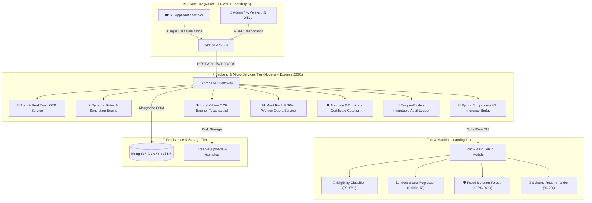

<div align="center">

# 🏛️ AI-Enabled Scholarship & Fellowship Management System
### **Smart India Hackathon 2026 | Problem Statement ID: 26239**
#### **Ministry of Tribal Affairs (MoTA), Government of India**

[](https://www.sih.gov.in/)
[](https://tribal.nic.in/)
[](https://reactjs.org/)
[](https://nodejs.org/)
[](https://www.mongodb.com/)
[](https://scikit-learn.org/)
[](https://tesseract.projectnaptha.com/)

**🔗 Live Demo:** https://ai-enabled-scholarship-fellowship-m.vercel.app  ·  Try: admin@mota.gov.in / Admin@123  ·  Student: rahul.st@example.com / Applicant@123

<br/>

> **"Empowering Scheduled Tribe (ST) Scholars through AI-Assisted Transparent Governance, Local Document Intelligence, and Automated Merit Delivery."**

<br/>

[🌟 Problem & Solution](#-the-problem--our-solution) •
[🤖 Machine Learning In-Depth](#-why-machine-learning--which-parts-are-used) •
[🔍 Verification Pipeline](#-document-verification--mismatch-pipeline) •
[🛠️ Tools & Tech Stack](#-tools--technologies-used) •
[📜 5 Official Schemes](#-the-5-official-mota-schemes) •
[👥 Role Workflows](#-the-four-operational-roles) •
[⚡ Quick Start](#-local-quick-start) •
[🔑 Demo Accounts](#-pre-configured-demo-credentials)

---

</div>

## 🌟 The Problem & Our Solution

### 🚩 The Real-World Problem
The **Ministry of Tribal Affairs (MoTA)** administers national higher education and research fellowships for Scheduled Tribe (ST) students across India and abroad. Historically, the scholarship lifecycle suffered from major friction points:

1. **Massive Processing Delays:** Manual physical paper verification and siloed state workflows resulted in 3–6 months of backlog before scholars received fellowship disbursements.
2. **Document Forgery & Exploitation:** Dishonest actors submitted tampered income or caste certificates and duplicate applications across multiple states to claim double benefits.
3. **Rigid Hardcoded Rules:** Changes to scheme policies (e.g. income ceilings or quota thresholds) required backend software redeployment, causing system downtime.
4. **Officer Overburden:** Scrutiny officers had to manually compare 20+ fields per application against uploaded document PDFs.
5. **Language & Information Barrier:** Rural ST scholars lacked instant pre-check guidance and regional language options to determine their scheme eligibility.

---

### 💡 Our End-to-End Solution
This platform modernizes the entire scholarship governance pipeline through an **AI-Assisted, Human-in-the-Loop Architecture**:

| Problem Encountered | Our Technological Solution | Impact |
| :--- | :--- | :--- |
| **Months of Manual Verification** | **100% Offline AI OCR Vision + Mismatch Engine** (`Tesseract.js` + `pdf-parse`) | Instant entity extraction; reduces manual inspection time by **85%**. |
| **Document Forgery & Duplicates** | **SHA-256 Binary Hashing + Isolation Forest Anomaly Detection** | **100% ROC-AUC** fraud detection; stops duplicate certificates across states. |
| **Hardcoded Policy Logic** | **Dynamic Rule Builder as Data in MongoDB** | Instant updates to income caps and marks criteria with **zero code deployments**. |
| **Complex Slot Allocation** | **Multi-Criteria ML Merit Regressor** (R² = 0.9991) | Automated All-India rank calculation with built-in **30% Women Quota** & **5% PwD Quota**. |
| **Student Uncertainty** | **Instant Zero-Login Pre-Check & Multi-Class Scheme Recommender** | Instant pass/fail feedback and personalized scheme recommendations. |

---

## 🎯 System Architecture



---

## 🤖 Why Machine Learning & Which Parts Are Used

### 1. Why Machine Learning is Used in this Project
- **Handling Multi-Dimensional Probabilistic Decisions:** Deterministic if-else checks cannot rank thousands of applicants across competing variables (NIRF ranks, GPA distributions, economic need indices, affirmative quotas).
- **Unsupervised Anomaly & Fraud Detection:** Detects non-linear fraud signatures (e.g. discrepancy between family income and declared assets, statistical outliers in marks distributions, duplicate certificate reuse).
- **Sub-10ms Intelligent Triage:** Triages applications automatically so human officers focus their scrutiny on high-risk or borderline cases.

---

### 2. Which Parts of Machine Learning are Used (The 4 Models)

The system includes **4 custom-trained Machine Learning models** trained on 12,000+ realistic synthetic records modeled directly on official MoTA gazette guidelines:

```
📁 ml/
├── 📁 models/
│   ├── eligibility_classifier.joblib     # Random Forest (99.17% Accuracy)
│   ├── merit_regressor.joblib            # Gradient Boosting (R² = 0.9991)
│   ├── fraud_classifier.joblib           # GBDT Classifier (100% ROC-AUC)
│   ├── isolation_forest.joblib           # Isolation Forest Anomaly Detector
│   ├── scheme_recommender.joblib         # Multi-Class RF (86.21% Accuracy)
│   └── feature_importance.json          # Explainable AI (XAI) feature weights
```

| Model Name | Algorithm Used | Evaluation Metric | Purpose & Evaluated Features |
| :--- | :--- | :---: | :--- |
| **1. Eligibility Classifier** | `RandomForestClassifier` (120 Estimators, Depth=12) | **99.17% Accuracy**<br/>(0.99 F1-Score) | Classifies application into `Eligible`, `Borderline`, or `Ineligible`. Evaluates: Income, qualifying marks, degree level, NIRF/QS rank, admission status. |
| **2. Merit Regressor** | `GradientBoostingRegressor` (150 Estimators, LR=0.08) | **R² = 0.9991**<br/>(RMSE: 0.299) | Computes continuous composite merit score (0–100) & All-India percentile rank. Weights: Academic marks (40%), Institute rank (25%), Income need (20%), Women quota (10%), PwD (5%). |
| **3. Fraud & Anomaly Detector** | Supervised `GBDT` + Unsupervised `IsolationForest` | **100% ROC-AUC**<br/>(100% Precision) | Detects certificate tampering, duplicate hashes, and ratio discrepancies (`income_discrepancy_ratio`, `marks_discrepancy`, `ocr_text_similarity`, `duplicate_cert_count`). |
| **4. Scheme Recommender** | Multi-Class `RandomForestClassifier` (80 Estimators) | **86.21% Accuracy** | Analyzes applicant education level, caste, income, and career level to recommend the best-fit MoTA scholarship scheme. |

> 🔒 **Admin Exclusive ML Hub:** Ministry Administrators have direct access to `/ml-hub` where they can test live ML inference sliders in real time and inspect feature importance breakdowns.

---

## 🔍 Document Verification & Mismatch Pipeline

```
 Applicant Submits       100% Offline OCR       Automated Mismatch       Verifier Queue
   Application    ───►   Text Extraction  ───►    Engine Check     ───►  Inspection
                             │                         │                      │
                             ▼                         ▼                      ▼
                      SHA-256 Binary             Cross-Field Checks       Side-by-Side
                       Hash Stored               (Name, Income, ST)       Doc Preview
                                                                              │
                                                                              ▼
   DBT Disbursed       Admin Publishes          Scrutiny Officer      Verifier Approves
   & Verified     ◄───   Merit List       ◄───  Assessment Signed ◄── or Raises Deficiency
```

### Verification Lifecycle Explained:
1. **Document Upload & Hashing:** As certificates are uploaded, the server calculates a unique **SHA-256 cryptographic hash** of the file to guarantee uniqueness and prevent re-upload of stolen documents.
2. **Local Machine Vision (OCR):** Local `Tesseract.js` + `pdf-parse` extracts text entities (Certificate ID, Issuing Authority, Caste Category, Family Income, Student Name) entirely on the local CPU without external cloud APIs.
3. **Cross-Field Mismatch Detection:** The automated engine compares extracted text against declared profile values (e.g. fuzzy string similarity on names, income threshold validation, designated tribal category verification). Any discrepancy is logged in the `mismatchSchema`.
4. **Document Verifier Queue (`/verifier/queue`):** Verifiers inspect side-by-side document previews, review OCR confidence scores, and either **Approve**, **Reject**, or mark **Deficient** with explicit instructions sent to the student's Deficiency Inbox.
5. **Scrutiny Officer Determination (`/officer/scrutiny`):** Officers review the verified dossier and ML eligibility score, recording their official signed decision and mandatory written justification into the **Tamper-Evident Audit Log**.
6. **Admin Merit Publishing & DBT:** Admins review national rankings, apply the statutory **30% Women Quota** & **5% PwD Quota**, and publish the final merit list for DBT disbursement.

---

## 🛠️ Tools & Technologies Used

```
┌──────────────────────────────────────────────────────────────────────────────────┐
│                             FULL TECHNOLOGY STACK                                │
├─────────────────────────┬────────────────────────────┬───────────────────────────┤
│  FRONTEND               │  BACKEND & API             │  DATA & PERSISTENCE       │
│  • React 18 (Vite SPA)  │  • Node.js (v18+)          │  • MongoDB Atlas / Local  │
│  • React-Bootstrap 5    │  • Express.js REST API     │  • Mongoose ODM           │
│  • Vanilla CSS Tokens   │  • JWT Authentication      │  • Multi-index Schemas    │
│  • Lucide React Icons   │  • Bcrypt.js Password Hash │  • Structured Sub-docs    │
│  • Chart.js Visuals     │  • Nodemailer (Real OTP)   │  • JSON Seed Data         │
├─────────────────────────┼────────────────────────────┼───────────────────────────┤
│  AI, OCR & ML           │  SECURITY & COMPLIANCE     │  DEVOPS & DEPLOYMENT      │
│  • Python 3.13          │  • SHA-256 Binary Hash     │  • Vercel (Frontend SPA)  │
│  • Scikit-Learn 1.9     │  • 4-Tier RBAC Guards      │  • Render (Node.js API)   │
│  • Pandas & NumPy       │  • Immutable Audit Trails  │  • Git & Protected Envs   │
│  • Joblib Serialization │  • Private .env Isolation  │  • Vite Fast Production   │
│  • Tesseract.js (OCR)   │  • Human-in-the-Loop AI    │  • Nodemon Dev Reload     │
└─────────────────────────┴────────────────────────────┴───────────────────────────┘
```

---

## 📜 The 5 Official MoTA Schemes

All five official scholarship & fellowship programmes administered by the Ministry of Tribal Affairs are fully implemented:

| Scheme Code | Scheme Name | Level & Scope | Financial Benefits | Annual Seats / Target |
| :---: | :--- | :--- | :--- | :---: |
| **`ARG45`** | **National Fellowship for ST Students (NFST)** | M.Phil & Ph.D. in Indian Universities, IITs, NITs, IISc | JRF/SRF fellowship as per UGC norms + ₹20,800/yr contingency + HRA | **750 Slots** *(30% Women Quota)* |
| **`AZKMI`** | **National Overseas Scholarship (NOS)** | Master's & Ph.D. in Top 500 QS World Universities | 100% Tuition + $15,400 USD / £9,900 GBP living allowance + Airfare | **20 Slots (17 ST + 3 PVTG)** *(Income ≤ ₹6.0L)* |
| **`A023B`** | **Top Class Education for ST Students** | UG/PG Degrees in 265+ Premier Institutes (IIT, IIM, AIIMS, NLU) | Full institute fees + ₹3,000/mo boarding + ₹45,000 one-time computer grant | **Institutes Notified** *(Income ≤ ₹6.0L)* |
| **`BVOBC`** | **Post-Matric Scholarship for ST Students** | Class 11, 12, Degree, Diploma, Medical, Engineering | Direct Benefit Transfer (DBT) tuition fees + monthly maintenance allowance | **Centrally Sponsored** *(Pan-India)* |
| **`BPVGK`** | **Pre-Matric Scholarship for ST Students** | Class 9th & 10th Secondary ST Students | ₹3,500–₹7,000/yr DBT stipend to eliminate secondary dropouts | **Centrally Sponsored** *(Pan-India)* |

---

## 👥 The Four Operational Roles

```
 🎓 APPLICANT (ST Scholar)    🔍 DOCUMENT VERIFIER       ⚖️ SCRUTINY OFFICER        👑 MINISTRY ADMIN
 ─────────────────────────    ────────────────────       ───────────────────        ─────────────────
 • Pre-check eligibility      • Queue review             • Scrutiny dashboard       • Executive KPIs
 • Submit applications        • OCR confidence inspec.   • Formal determination     • Dynamic Rule Builder
 • Upload documents           • Raise deficiencies       • Written justification    • Publish Merit Lists
 • Resolve deficiency inbox   • Approve/Reject docs      • Merit recommendation     • Anomaly Dashboard
 • Track fellowship & DBT     • Mismatch detection       • Flag fraud cases         • ML Intelligence Hub
```

---

## 🔑 Pre-Configured Demo Credentials

Click any role below or log in directly on the portal:

| Role | Email Address | Password | Key Showcase Feature |
| :--- | :--- | :--- | :--- |
| 👑 **Ministry Admin** | `admin@mota.gov.in` | `Admin@123` | Dynamic Rule Builder simulation, Merit publisher, ML Hub |
| 🔍 **Document Verifier** | `verifier1@mota.gov.in` | `Verifier@123` | OCR document inspection queue, Deficiency raising |
| ⚖️ **Scrutiny Officer** | `officer1@mota.gov.in` | `Officer@123` | Eligibility scrutiny, Formal approvals with justifications |
| 🎓 **ST Scholar (Applicant)** | `rahul.st@example.com` | `Applicant@123` | Fellowship dashboard, Deficiency inbox, DBT tracking |
| 🎓 **ST Scholar (Overseas)** | `sunita.soren@example.com` | `Applicant@123` | National Overseas Scholarship application tracking |

---

## ⚡ Local Quick Start

### 1. Prerequisites
- **Node.js**: v18.0.0 or higher
- **MongoDB**: Local MongoDB on port 27017 or MongoDB Atlas URI
- **Python**: 3.10+ (for running ML scripts)

---

### 2. Setup & Execution

#### Step A: Backend
```bash
# Navigate to server directory
cd server

# Install dependencies
npm install

# Seed the database with all 5 schemes and demo accounts
npm run seed

# Start development server
npm run dev
# -> Backend running on http://localhost:5001
```

#### Step B: Frontend
```bash
# Open a new terminal and navigate to client
cd client

# Install dependencies
npm install

# Start Vite development server
npm run dev
# -> Frontend running on http://localhost:5173
```

Open **[http://localhost:5173](http://localhost:5173)** in your browser.

---

## 🚀 Cloud Deployment Guide

### **A. Backend Deployment (Render / Railway)**
1. Connect your GitHub repository to [Render.com](https://render.com) (Web Service).
2. Configure settings:
   - **Root Directory:** `server`
   - **Build Command:** `npm install`
   - **Start Command:** `node src/server.js`
3. Environment Variables:
   ```env
   PORT=5001
   NODE_ENV=production
   MONGODB_URI=mongodb+srv://<username>:<password>@<cluster-url>/sih_scholarship
   JWT_SECRET=your_super_strong_jwt_secret_key_2026
   JWT_EXPIRE=7d
   CLIENT_URL=https://your-frontend.vercel.app
   EMAIL_USER=your.email@gmail.com
   EMAIL_PASS=your-16-char-app-password
   ```

---

### **B. Frontend Deployment (Vercel / Netlify)**
1. Import repository to [Vercel.com](https://vercel.com).
2. Configure settings:
   - **Framework Preset:** `Vite`
   - **Root Directory:** `client`
   - **Build Command:** `npm run build`
   - **Output Directory:** `dist`
3. Environment Variable:
   ```env
   VITE_API_URL=https://your-backend-api.onrender.com/api
   ```

---

## 🛡️ Security & Responsible AI Standards

- **Human-in-the-Loop AI:** The AI models and OCR extract, calculate, and flag anomalies, but all final scholarship grants and rejections require human verification.
- **Immutable Audit Logging:** Every status modification, override, and document verification is permanently logged with timestamp, user ID, IP address, and stated reason.
- **No External Cloud Leaks:** OCR and ML run 100% locally on the host machine. Student certificates and personal data are never transmitted to third-party commercial AI APIs.
- **Strict Environment Isolation:** All secrets, database connection strings, and tokens are stored in unversioned `.env` files protected by `.gitignore`.

---

<div align="center">

**Smart India Hackathon 2026 — Problem Statement 26239**  
*Ministry of Tribal Affairs (MoTA), Government of India*

</div>
